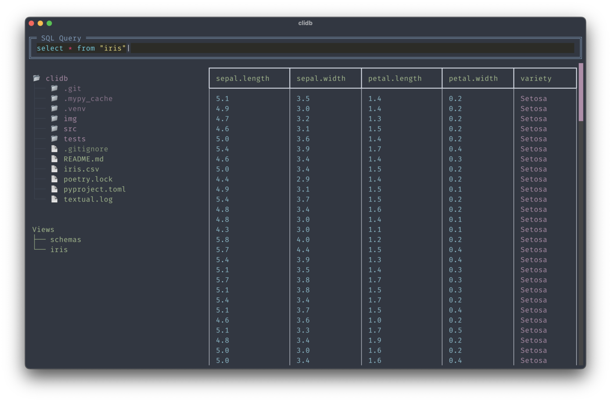
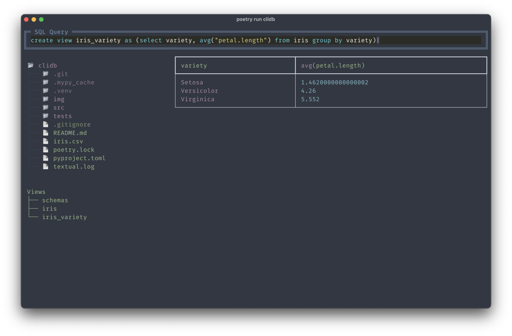
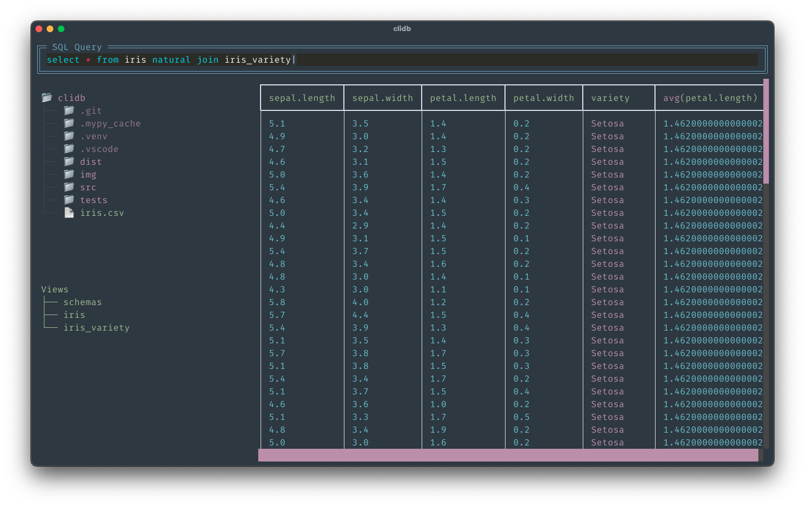

# clidb



clidb is a command line sql client for local data files, allowing these to be queried (even joined) and viewed. It natively supports CSV and parquet formats, with support for others being added over time via the optional pandas dependency.

## Data Formats
The following file types can be opened as views in clidb:
- csv
- parquet(.gz)

With pandas installed, the following are also supported:
- json(l)
- ...

## Usage

This package can be installed with:

```bash
pip install clidb
```

and executed via:

```bash
clidb
```

The optional pandas dependencies can be installed via:
```bash
pip install "clidb[pandas]"
```

### Arguments

If a filename is supplied as an argument to clidb then it will open the data file as a view.

If a directory is supplied then the directory view will open in that location.

For example:

```bash
clidb data/iris.csv
```

## Advanced Usage
New views can be created from an opened file. For example if `iris.csv` was opened as the view `iris`, then we could create a new view:
```sql
create view iris_variety as (select variety, avg("petal.length") from iris group by variety)
```



Views can be joined together, for example:
```sql
select * from iris natural join iris_variety
```


